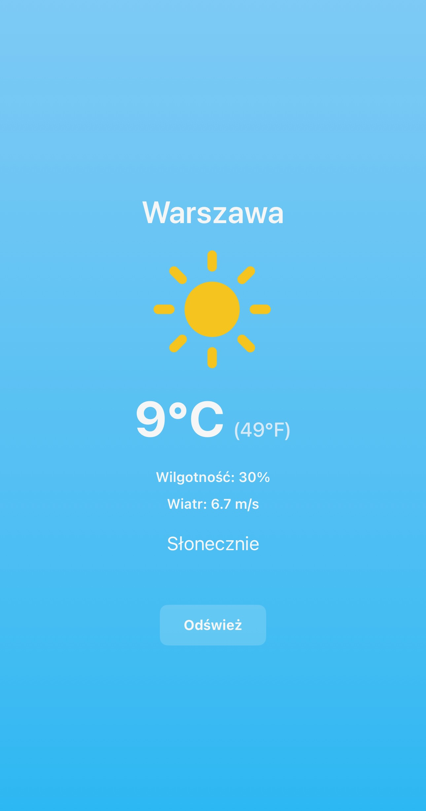

```markdown
# WeatherApp

A SwiftUI weather app displaying real-time weather data based on the user's location.

This project demonstrates:
- **CoreLocation** for location detection
- **Reverse Geocoding** (Apple’s CLGeocoder) to get city names in local language
- **OpenWeather** API for weather data
- **MVVM architecture** for clean, scalable code
- **Dynamic SF Symbols** for different conditions (Sunny, Cloudy, Rainy, Snow, Storm)
- **Localization** in Polish (pl.lproj) and English (en.lproj)
- **Gradient backgrounds** depending on weather conditions
- **Humidity and wind speed** displayed alongside temperature

---

## Features

- **Auto-detect location**: App automatically obtains user’s current position
- **City name** via reverse geocoding
- **Current weather**: temperature in °C and °F, humidity, wind speed
- **Multiple weather conditions**: Sunny, Cloudy, Rainy, Snow, Storm
- **Refresh** button to re-check location and weather
- **Localization**: Polish and English strings
- **Gradient backgrounds** that change based on the weather condition

---

## Installation

1. **Clone** the repository:
   ```bash
   git clone https://github.com/brzezinskisebastian/WeatherApp.git
   ```
2. **Open** the project in Xcode:
   - Double-click `Weather.xcodeproj` (or open via Xcode → File → Open).
3. **Insert** your own OpenWeather API key:
   - In `Weather/Services/WeatherAPI.swift`, replace `"YOUR_API_KEY"` with your actual key.
4. **Run** the app on a simulator or real device (iOS 15+ recommended).

---

## Screenshots

|  |

---

## Roadmap / Possible Improvements

- **7-day forecast** using One Call API
- **Widget** (WidgetKit) for quick weather preview
- **Animated icons** (e.g. Lottie)
- **Unit tests** for ViewModels

---

## License

This project is released under the [MIT License](LICENSE).  
Feel free to modify and distribute as you wish.

---

## Author

**Sebastian Brzeziński**  
- [GitHub Profile](https://github.com/brzezinskisebastian)  
- [LinkedIn](https://www.linkedin.com/in/sebastian-brzeziński-a9a142144/)
